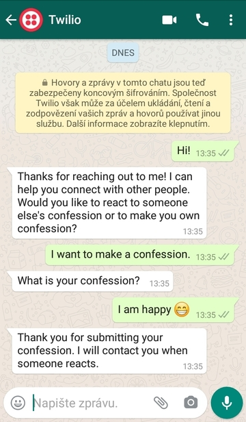
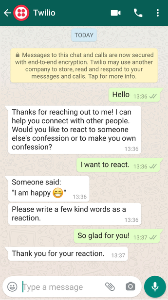
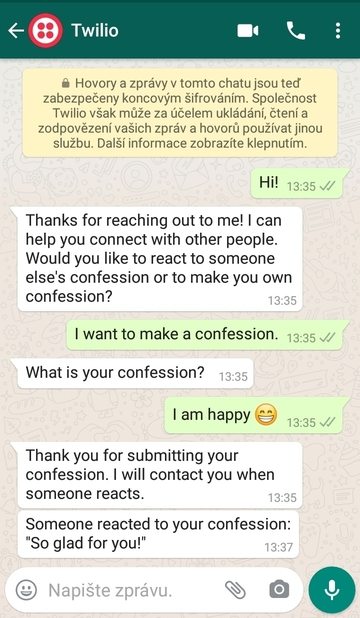

# TwilioHackathon 2020 chat bot app

A chat bot that connects people who submit confessions with people who answer them.

See the [post on DEV](https://dev.to/petr7555/twiliohackathon-autopilot-node-js-postgresql-3p09).

PostgreSQL runs on [ElephantSQL](https://www.elephantsql.com/).
Node server runs on [render](https://twilio-hackathon.onrender.com/).

      

## Deployment
- You need an underlying Twilio Autopilot that uses endpoints in `index.js`.
  - *Support for Autopilot will be discontinued on February 25, 2023, and the product will no longer be accessible starting August 25, 2023.*
- After integrating the Autopilot with WhatsApp, set `SENDER` environment variable.
- Create a PostgreSQL database and set `DATABASE_URL` environment variable.

Overall, you need to specify the following environment variables:

```
TWILIO_ACCOUNT_SID=************************
TWILIO_AUTH_TOKEN=*************************
SENDER=whatsapp:+123456789
DATABASE_URL=postgres://**********
```
